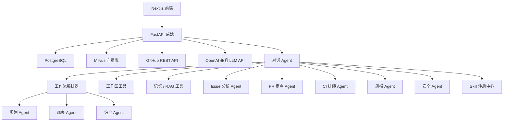

# DevFlow AI

DevFlow AI 是一个面向 GitHub PR / Issue 研发协作的全栈 AI Agent 项目。系统会连接仓库数据，分析 Issue、PR diff、CI 日志、项目知识库和本地工作区代码，并返回结构化建议与安全的操作草稿。

## 核心能力

- 连接并同步 GitHub 仓库中的 Issue、Pull Request、PR 文件、Review 评论、Workflow Run、Job 和日志。
- Issue 分析：分类、优先级、复杂度、推荐负责人、重复候选和行动项。
- PR 审查：摘要、关键变更、风险点、检查清单、测试建议和需要重点关注的文件。
- CI 排障：失败类型、可能原因、排查步骤和相关上下文。
- Agent 对话：`ChatAgent` 使用原生工具调用，串联工作区、记忆、RAG、Issue、PR、CI、周报和安全工具。
- 多 Agent 工作流审查：`WorkflowOrchestrator` 构建 Planner -> 专用 Agent -> Observer -> Synthesis 的闭环，用于 PR 就绪度、阻塞项、优先级和跨领域工程决策。
- Skill Runtime：按用户显式指定或触发条件选择 `SKILL.md`，只向当前任务加载完整指令与受限资源；显式 Skill 校验允许工具，多 Agent 中的专用 Agent 分别加载自己的 Skill，并把版本、激活原因、指令摘要和执行校验写入 trace。
- 工作区代码工具：安全地列出文件、读取文件和搜索本地代码。
- RAG 聚焦 Issue 描述、PR 说明与 Review 评论、失败 CI 日志、项目文档、上传知识和已批准的长期记忆；当前代码走工作区/词法检索，团队与实时状态走结构化查询。
- 生成工程周报。
- 基础 Eval 覆盖 Issue 分类、PR 覆盖度、RAG 命中率、工具 schema 就绪度和结构化输出校验。

## 技术栈

- 后端：Python、FastAPI、Pydantic、SQLAlchemy、PostgreSQL、Milvus、httpx、LangChain。
- Agent 编排：原生工具调用 + 专用分析 Agent。
- 前端：Next.js、TypeScript、Tailwind CSS、React Query。
- 基础设施：Docker Compose 与 `.env` 配置。

## 架构



## 快速开始

```bash
cp .env.example .env
docker compose up -d postgres etcd minio milvus

cd backend
python -m venv .venv
.venv\Scripts\activate
pip install -r requirements.txt
uvicorn app.main:app --reload
```

另开一个终端：

```bash
cd frontend
npm install
npm run dev
```

默认地址：

- 后端：http://localhost:8000
- API 文档：http://localhost:8000/docs
- 前端：http://localhost:3000

## RAG 知识问答系统

项目内置了与第 7.1 节流程一一对应的完整 RAG 系统：知识库创建向导、文档解析、段落感知切片、Embedding、向量/关键词混合检索、重排、召回测试、问答工作室、上下文组装、基于证据生成和编号引用。支持 TXT、Markdown、PDF、DOCX、JSON、CSV 与日志文件；重复文件会按 SHA-256 跳过。

对话链路采用混合 RAG：`ContextAssembler` 会在调用 ChatAgent 前按原始问题检索并注入证据；进入推理循环后，模型仍可把 `rag.search_similar_documents` 当作工具，改写查询、连续补查不同资料，并根据多次工具结果交叉验证答案。

项目不会把所有私域数据都向量化。只有需要跨来源语义召回、会反复使用的非结构化知识进入 RAG；源码与配置以当前 checkout 为准，优先通过 `workspace.search_code` 和 `workspace.read_file` 检索；Issue、PR、CI 的状态字段、团队成员和周报等结构化或派生数据直接查数据库/API。RAG 返回的是候选证据，涉及实时状态和当前代码时仍要回到权威数据源核验。

从旧版本升级后，请对每个知识库调用一次 `POST /api/rag/{repo_id}/reindex`。重建会按新边界清理历史向量和旧会话 Document；只部署代码不会主动删除已有索引。

如果只想先验证页面、结构化数据和无模型兜底回答，Windows 本地可以用下面的脚本启动 SQLite 演示环境：

```powershell
.\scripts\start_rag.ps1
```

脚本会关闭 Milvus，使用 deterministic embedding 和启发式重排，并停用演示知识库的 `0.8` 分数阈值，避免只有关键词分支时全部候选都被过滤。因此它可以验证页面、上传解析、关系库存储、Hybrid 的关键词分支和引用展示，但向量检索状态会明确显示 `degraded`，不能用来证明完整 RAG 已经跑通。要验证向量召回、混合检索和重建索引，仍需先按“快速开始”启动 PostgreSQL、etcd、MinIO 和 Milvus。

知识库默认选择 `Qwen/Qwen3-Embedding-0.6B` 与 `qwen3-rerank`。安装 `backend/requirements-local-embedding.txt` 后可运行本地 Qwen Embedding；配置 `DASHSCOPE_API_KEY`、`RERANK_BASE_URL` 后可切换百炼 `text-embedding-v4` 与 `qwen3-rerank`。默认 Embedding 依赖缺失时系统会明确报错，不会在生产配置下静默改用另一套向量空间；只有上面的本地演示脚本会显式选择 deterministic embedding。已经配置 `LLM_API_KEY` 时，可用 `.\scripts\start_rag.ps1 -UseConfiguredLLM` 启用模型生成。

RAG API：

```text
POST /api/rag/knowledge-bases
GET  /api/rag/knowledge-bases
GET  /api/rag/knowledge-bases/{repo_id}
POST /api/rag/knowledge-bases/{repo_id}/documents
POST /api/rag/knowledge-bases/{repo_id}/retrieval-tests
GET  /api/rag/{repo_id}/status
POST /api/rag/{repo_id}/search
POST /api/rag/{repo_id}/ask
POST /api/rag/{repo_id}/reindex
```

## ChatAgent RAGAS 评测

启动主应用后打开 `http://127.0.0.1:3000/evals`，选择仓库、固定评测集和 Top-K，再点击“运行固定 RAGAS 评测”。评测会在隔离会话中真实运行生产 ChatAgent 和工具集，收集预检索与 Agent 二次检索证据，然后使用 Ragas 0.4 Collections API 计算 Context Precision、Context Recall、Faithfulness、Answer Relevancy 和 Agent Goal Accuracy。结果会保存评测集 Hash、阈值、逐题工具轨迹、检索证据、硬规则与失败诊断，便于对同一基线做回归。

默认 Judge 复用 `LLM_API_KEY`、`LLM_BASE_URL` 和 `LLM_MODEL`；也可以通过 `.env` 中的 `RAGAS_JUDGE_API_KEY`、`RAGAS_JUDGE_BASE_URL`、`RAGAS_JUDGE_MODEL` 单独配置。主项目内置的正式基准位于 `docs/datas/evals/rag_cases.json`，启动时会检查用例引用的文档是否已进入当前仓库知识库：

```http
POST /api/evals/rag/run
Content-Type: application/json

{
  "repo_id": "<repository-uuid>",
  "run_judge": true,
  "top_k": 5,
  "suite_id": "devflow-real-project-rag-baseline"
}
```

提交接口会立即返回 `queued` 状态和 `eval_id`，ChatAgent 与 RAGAS 在后台继续运行。通过 `GET /api/evals/{eval_id}` 轮询 `result.progress`；状态变为 `passed`、`failed`、`error` 或 `no_cases` 时结束。网页会自动轮询，刷新或离开页面不会中断已经提交的任务。

整体通过要求硬规则全部满足，并且五项语义指标都达到 `.env` 中对应的 `RAGAS_*_MIN` 门槛。页面把“执行状态”和“质量状态”分开显示：低分是质量失败；Judge 调用失败或指标缺失是评测不完整，不能伪装成质量结论。

评测失败后可以直接在同一页面继续处理：

- 展开 Case 查看实际回答、参考答案、检索来源、工具轨迹和可执行诊断；
- 对 Judge 超时或缺失指标点击“仅重试异常评分”，复用已经保存的回答和证据，不重新运行 ChatAgent；
- 选择两个相同评测集 Hash、Ragas/Judge 配置和 Top-K 的结果做回归对比；
- 生成 `create_issue` 类型的 ActionDraft，把失败 Case、证据和建议带入人工确认流程，不会直接写入 GitHub。
