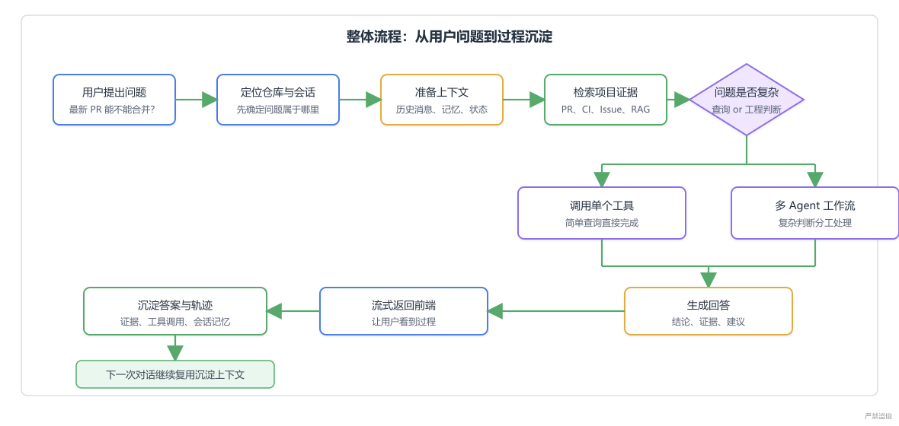
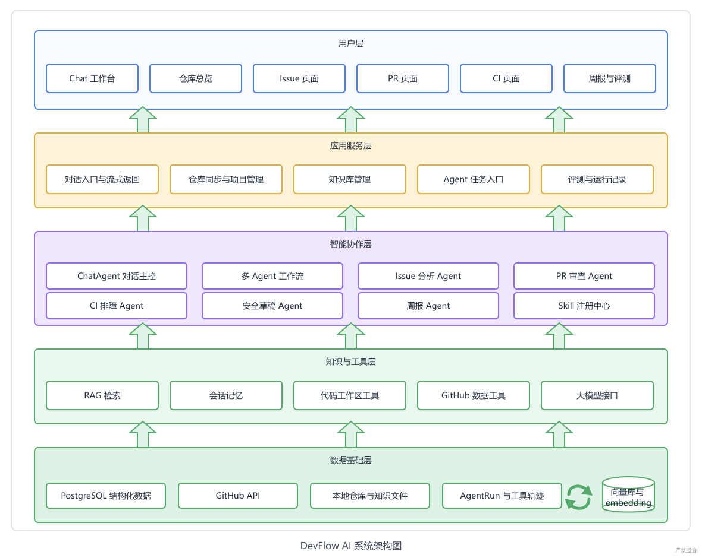
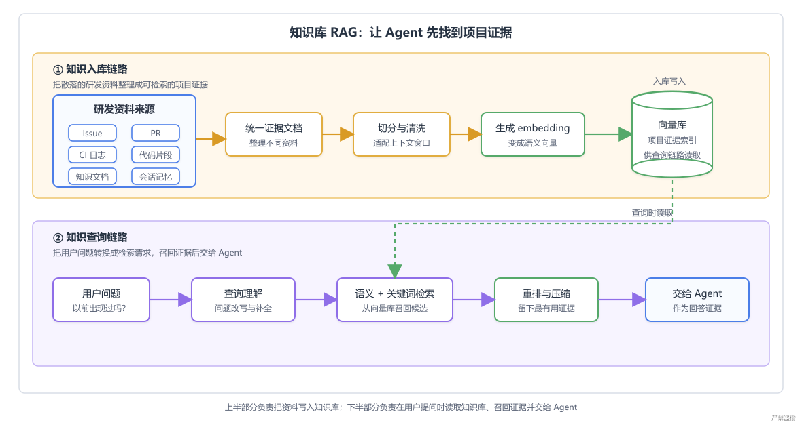
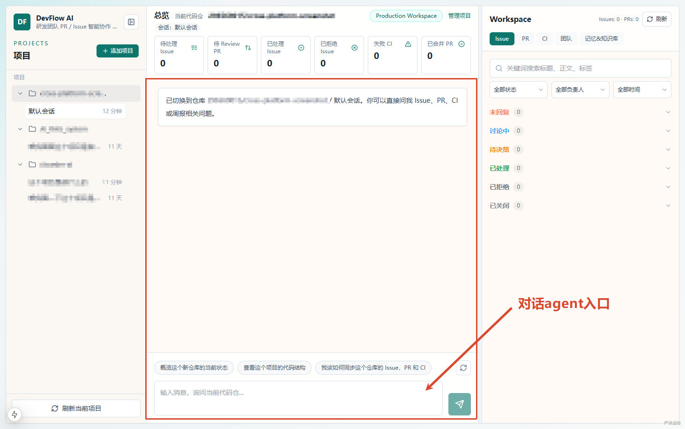
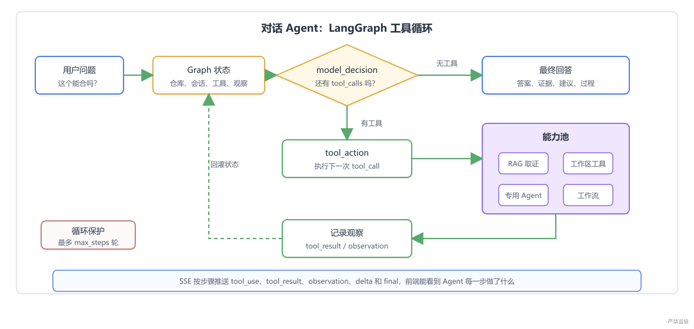
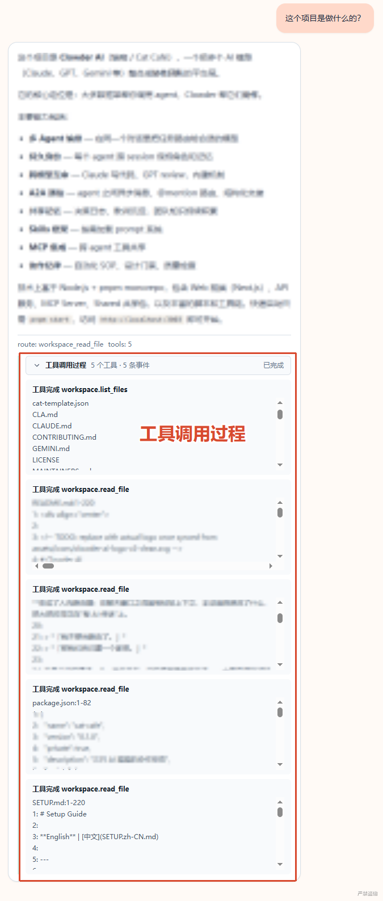
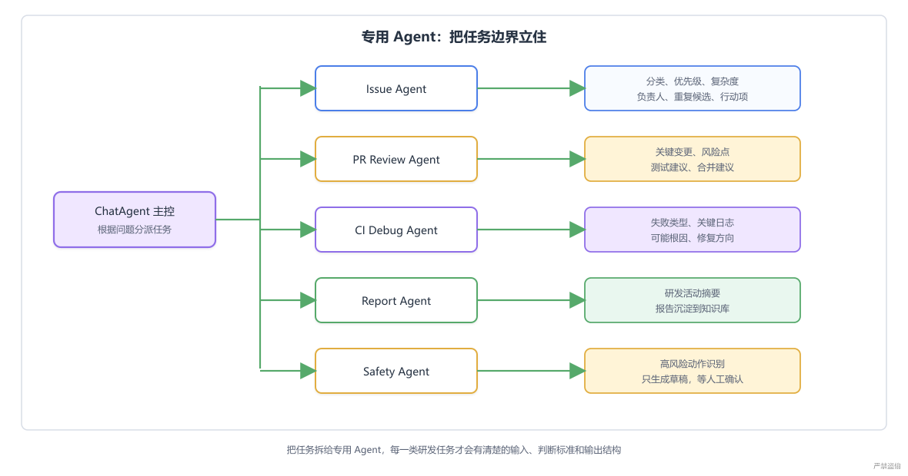
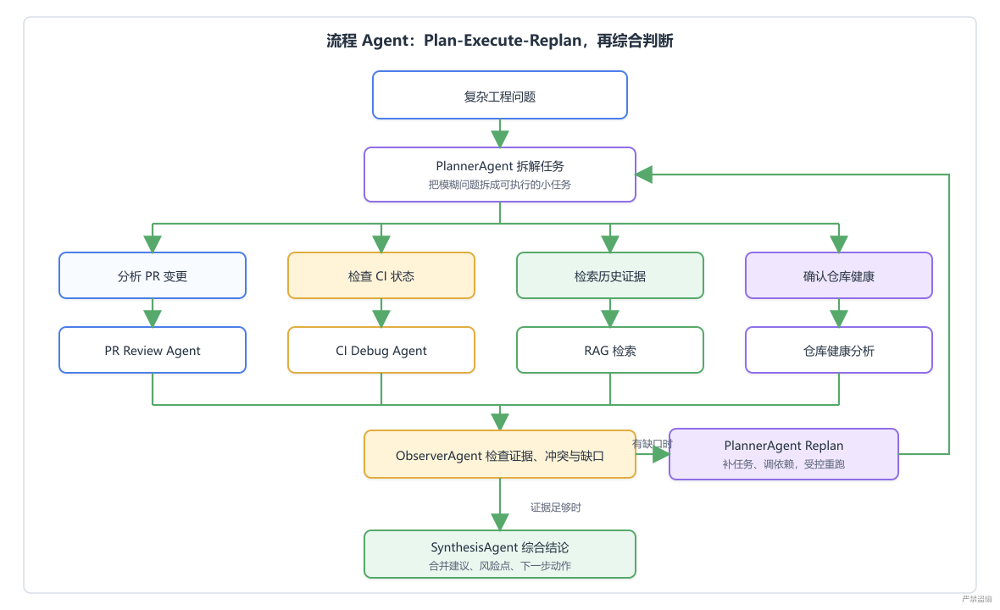
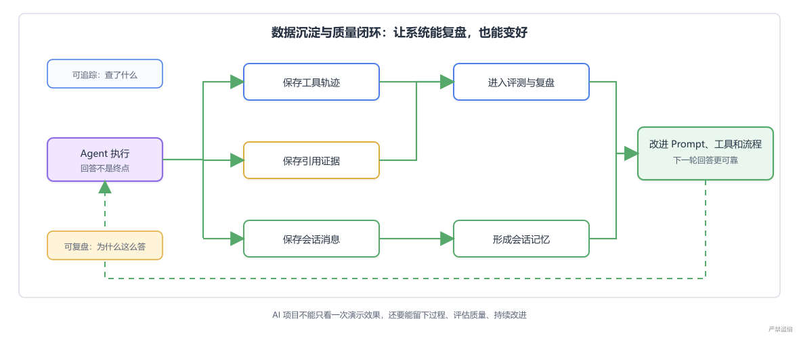
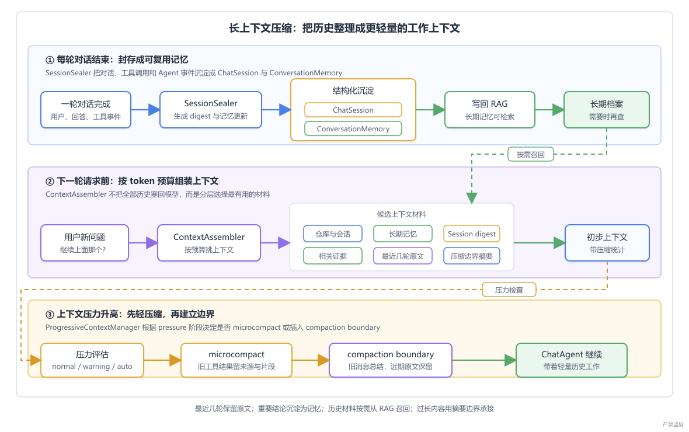

# DevFlow AI

DevFlow AI 是一个面向 GitHub PR、Issue 与 CI 场景的全栈 AI Agent 协作系统。

它不是“用户问一句、大模型答一句”的聊天壳，而是一条研发协作流水线：

> 先找上下文，再做判断，最后把过程留下来。

系统会围绕仓库、Issue、PR、CI、项目文档、会话记忆和本地代码工作区进行取证，再由 ChatAgent、专用 Agent 与多 Agent 工作流完成分析，最终输出带依据、可追踪、可复盘的工程建议。

## 一条请求如何经过系统

以“最新 PR 能不能合并？”为例，系统不会直接让模型生成答案，而是依次完成：

1. **定位**：确认当前仓库、会话、PR 和问题范围。
2. **取证**：查询 PR、CI、Issue、RAG 历史证据、项目文档和代码工作区。
3. **判断**：简单问题调用单个专用 Agent；复杂问题进入多 Agent 工作流。
4. **沉淀**：保存消息、运行记录、工具轨迹、引用证据、记忆和评测结果。

<p align="center">
  <a href="docs/images/architecture/02-request-lifecycle.png">
    
  </a>
</p>

## 整体架构

DevFlow AI 采用分层设计：

<p align="center">
  <a href="docs/images/architecture/01-overall-architecture.png">
    
  </a>
</p>

可以把它压缩成一句话：

> **上层负责交互，中层负责调度和判断，下层负责证据与记忆。**

## 五层架构职责

| 层级 | 主要职责 | 代表模块 |
| --- | --- | --- |
| 用户层 | 用户最终看到和操作的界面 | Chat、仓库总览、Issue、PR、CI、周报、评测 |
| 应用服务层 | 请求流转与业务编排 | 仓库定位、会话管理、流式返回、结果持久化 |
| 智能协作层 | 判断问题类型并组织工具与 Agent | ChatAgent、专用 Agent、PlannerAgent、WorkflowOrchestrator、Skill Registry |
| 知识与工具层 | 给 Agent 提供“手和眼睛” | RAG、Memory、Workspace、GitHub API、LLM API |
| 数据基础层 | 保存事实、运行过程和评测数据 | PostgreSQL、Milvus、对象存储、AgentRun、Tool Trace、Eval |

## RAG 知识库

RAG 是 **Retrieval-Augmented Generation（检索增强生成）** 的缩写。

在 DevFlow AI 中，RAG 的职责不是替模型做最终判断，而是：

> **在模型回答前，把与当前问题相关的项目证据找回来。**

RAG 分为两个核心环节：

### 知识入库

1. 提取 Issue、PR、Review 评论、失败 CI 日志、项目文档和长期记忆。
2. 清洗与切分文本。
3. 生成 Embedding。
4. 写入 Milvus 向量库，并保留来源与元数据。

### 知识查询

1. 对用户问题进行向量化或关键词检索。
2. 使用混合检索召回候选证据。
3. 执行 Rerank 与相关性过滤。
4. 将证据按上下文预算组装后交给 ChatAgent。

<p align="center">
  <a href="docs/images/architecture/03-rag-pipeline.png">
    
  </a>
</p>

进入 RAG 的主要内容：

- Issue 标题与正文。
- PR 标题、正文和 Review 评论。
- 有日志的失败 CI。
- 项目文档与人工上传知识。
- 经过批准、适合长期复用的记忆。

代码源码以当前工作区为准，优先使用文件读取和词法检索；Issue、PR、CI 的状态字段直接查询数据库或 API；会话历史由专用记忆系统按会话范围读取。

RAG 不是所有项目数据的统一入口，它更像一个会翻项目旧资料的同事。

## 对话 Agent（ChatAgent）

ChatAgent 是 DevFlow AI 最重要的交互入口，也是一个带状态机的“前台调度员”。

<p align="center">
  <a href="docs/images/architecture/04-chatagent-overview.png">
    
  </a>
</p>

它首先要判断：

- “这个 Issue 应该谁处理？” -> Issue 分析能力。
- “这个 PR 风险在哪？” -> PR 审查能力。
- “CI 为什么失败？” -> CI 排障能力。
- “最新 PR 能不能合并？” -> 多 Agent 工作流。

ChatAgent 的核心职责不是替所有模块干活，而是 **组织这些模块一起干活**。

### ReAct 与 LangGraph

ReAct 是 reasoning（推理）+ acting（行动）的简称。

DevFlow AI 采用 ReAct 思想，并结合 LangGraph、原生工具调用和工程可观测记录，形成闭环：

<p align="center">
  <a href="docs/images/architecture/05-chatagent-langgraph.png">
    
  </a>
</p>

关键节点：

1. **准备 Graph 状态**：加入用户消息、会话、记忆、Skill 和可用工具。
2. **模型决策节点**：由模型决定直接回答，还是调用工具。
3. **工具执行节点**：执行 RAG 检索、工作区读取、GitHub 查询或多 Agent 工作流。
4. **条件边回到模型**：工具结果先作为观察，再由模型决定继续取证还是输出最终答案。

> 大模型可以选择工具，但工具如何执行、过程如何记录、结果如何返回，都由系统控制。

### 工具调用可观测

ChatAgent 会实时展示工具调用过程。用户不仅能看到最终答案，还能看到系统查询了什么、调用了什么、引用了哪些证据。

<p align="center">
  <a href="docs/images/architecture/06-tool-call-trace.png">
    
  </a>
</p>

## 专用 Agent

专用 Agent 将“角色设定”工程化和系统化，使不同任务拥有独立、互不干扰的 Prompt 上下文。

| Agent | 关注点 | 典型输出 |
| --- | --- | --- |
| Issue Agent | 分类、优先级、复杂度、负责人、重复问题 | 分诊结果与行动项 |
| PR Review Agent | 改动范围、风险文件、测试覆盖、兼容性、安全性 | 审查意见与合入建议 |
| CI Debug Agent | 失败类型、关键日志、失败步骤、可能根因 | 排障步骤与修复建议 |
| Report Agent | 仓库活动、Issue/PR/CI 汇总 | 工程周报 |
| Safety Agent | 写操作风险、权限与审批要求 | 安全草稿与风险提示 |

<p align="center">
  <a href="docs/images/architecture/07-specialized-agents.png">
    
  </a>
</p>

拆开之后，每个 Agent 的输入、判断标准和输出结构都更清晰：

- Issue Agent 不需要获取所有 CI 日志细节。
- CI Debug Agent 不需要判断需求优先级。
- PR Review Agent 不应该顺手生成周报。

职责分工明确，系统才更容易扩展、测试和复盘。

## 多 Agent 工作流

对于跨领域问题，单点工具调用并不够，需要受控的 **Plan-Execute-Replan** 工作流。

典型问题包括：

- 这个 CI 失败会不会影响 PR 合入？
- 这个需求现在应该优先处理吗？
- 当前版本发布还有哪些阻塞？

<p align="center">
  <a href="docs/images/architecture/08-multi-agent-workflow.png">
    
  </a>
</p>

各角色职责：

- **PlannerAgent**：把模糊问题拆成可执行任务。
- **WorkflowOrchestrator**：按依赖关系调度任务；可并行则并行，不可并行则等待。
- **专用 Agent**：分别取证，例如 PR 看变更、CI 看日志、RAG 找历史材料。
- **ObserverAgent**：检查证据缺口、冲突与结论稳定性，必要时触发补查。
- **SynthesisAgent**：综合全部材料，生成最终结论。

多 Agent 的价值不在于 Agent 数量多，而在于：

> **复杂问题可以先拆开取证，再合起来判断。**

## 数据沉淀与质量闭环

研发协作不是一次性问答。下一轮对话、效果评测、安全审计和问题复盘，都依赖历史过程。

系统会保存：

- 会话消息和会话摘要。
- Agent 运行记录。
- 工具调用轨迹。
- 引用证据。
- 长期记忆。
- 评测结果。

<p align="center">
  <a href="docs/images/architecture/09-quality-loop.png">
    
  </a>
</p>

这些记录让系统具备可追踪、可复盘、可评测的能力。

## 长上下文压缩

Agent 一旦持续工作，上下文会快速累积：用户消息、模型回答、工具结果、RAG 证据、CI 日志、PR 分析和历史摘要。

如果每次都把全部历史原样塞给模型，会遇到两个问题：

1. 上下文窗口不足，请求失败。
2. 无关内容过多，模型抓不住当前重点。

长上下文压缩不是删除历史，而是把历史整理成更适合继续工作的形态：

- 最近几轮对话尽量保留原文。
- 重要结论沉淀为摘要和长期记忆。
- 与当前问题相关的历史通过 RAG 或证据检索重新召回。
- 很长的工具结果只保留来源、关键片段和恢复方式。
- 历史过长时记录压缩起点，后续对话从摘要继续。

<p align="center">
  <a href="docs/images/architecture/10-context-compression.png">
    
  </a>
</p>

> 压缩不是让 Agent 忘掉过去，而是让它带着更清楚、更轻量的过去继续工作。

## 核心能力

- 连接并同步 GitHub 仓库中的 Issue、Pull Request、PR 文件、Review 评论、Workflow Run、Job 和日志。
- Issue 分析：分类、优先级、复杂度、推荐负责人、重复候选和行动项。
- PR 审查：摘要、关键变更、风险点、检查清单、测试建议和重点文件。
- CI 排障：失败类型、可能原因、排查步骤和上下文。
- ChatAgent 对话：串联工作区、记忆、RAG、Issue、PR、CI、周报和安全工具。
- 多 Agent 工作流：执行 Planner -> 专用 Agent -> Observer -> Synthesis 闭环。
- Skill Runtime：按任务加载完整 `SKILL.md`，并把版本、激活原因和执行校验写入 trace。
- 工作区代码工具：安全列出文件、读取文件和搜索本地代码。
- RAG：覆盖 Issue、PR、Review、失败 CI、项目文档、上传知识和长期记忆。
- 工程周报与 RAGAS 质量评测。

## 技术栈

- **后端**：Python、FastAPI、Pydantic、SQLAlchemy、PostgreSQL、Milvus、httpx、LangChain、LangGraph。
- **Agent**：原生工具调用、ReAct、专用 Agent、Plan-Execute-Replan、Skill Registry。
- **RAG**：文档解析、切片、Qwen Embedding、向量检索、关键词检索、Rerank、引用生成。
- **前端**：Next.js、TypeScript、Tailwind CSS、React Query。
- **基础设施**：Docker Compose、etcd、Milvus、S3 兼容对象存储。

## 代码结构

```text
DevFlow-AI/
├─ backend/
│  └─ app/
│     ├─ api/                 # FastAPI 路由与请求入口
│     ├─ core/                # 配置、安全与日志
│     ├─ db/                  # 数据模型与数据库会话
│     ├─ schemas/             # API 数据结构
│     ├─ services/
│     │  ├─ agents/           # ChatAgent、专用 Agent、工作流编排
│     │  ├─ github/           # GitHub 数据访问与操作
│     │  ├─ llm/              # LLM 客户端、提示词与结构化输出
│     │  └─ rag/              # 入库、检索、重排、问答与向量存储
│     ├─ skills/              # SKILL.md 指令与资源
│     └─ tests/               # 后端测试
├─ frontend/                  # Next.js 前端
├─ docs/                      # 架构、API 与示例文档
├─ scripts/                   # 启动、演示数据与维护脚本
└─ docker-compose.yml         # PostgreSQL、Milvus、etcd、对象存储
```

## 快速开始

### 1. 配置环境变量

```bash
cp .env.example .env
```

按需填写：

- `LLM_API_KEY`
- `LLM_BASE_URL`
- `LLM_MODEL`
- `GITHUB_TOKEN`
- Embedding 与 Rerank 相关配置

### 2. 启动基础设施

```bash
docker compose up -d postgres etcd minio milvus
```

### 3. 启动后端

```bash
cd backend
python -m venv .venv
```

Windows：

```powershell
.venv\Scripts\activate
pip install -r requirements.txt
pip install -r requirements-local-embedding.txt
uvicorn app.main:app --reload
```

macOS / Linux：

```bash
source .venv/bin/activate
pip install -r requirements.txt
pip install -r requirements-local-embedding.txt
uvicorn app.main:app --reload
```

### 4. 启动前端

```bash
cd frontend
npm install
npm run dev
```

### 默认地址

- 前端：http://localhost:3000
- 后端：http://localhost:8000
- API 文档：http://localhost:8000/docs

## Windows 本地演示

只需要验证页面、结构化数据和关键词检索时，可以启动 SQLite 演示模式：

```powershell
.\scripts\start_rag.ps1
```

该模式会关闭 Milvus，并使用 deterministic embedding 与启发式重排。

验证完整向量检索、混合检索和重建索引，仍需启动 PostgreSQL、etcd、Milvus 和对象存储。

## 关键设计结论

DevFlow AI 的系统结构可以概括为：

- 前端负责交互，后端负责任务流转，Agent 负责判断，数据层负责保存事实。
- RAG 保证回答基于项目证据，而不是凭空生成。
- ChatAgent 理解用户意图，并决定调用工具还是进入复杂工作流。
- 专用 Agent 隔离 Issue、PR、CI 等不同任务的 Prompt 与判断标准。
- PlannerAgent 与 WorkflowOrchestrator 处理跨领域、需要多方取证的问题。
- 数据沉淀、质量闭环和上下文压缩支撑长期协作、复盘与评测。

最终链路是：

> **用户提出问题，系统定位上下文，RAG 和工具负责取证，ChatAgent 负责调度，专用 Agent 负责专项分析，多 Agent 工作流负责复杂判断，最后把过程沉淀成记忆、记录和评测数据。**
